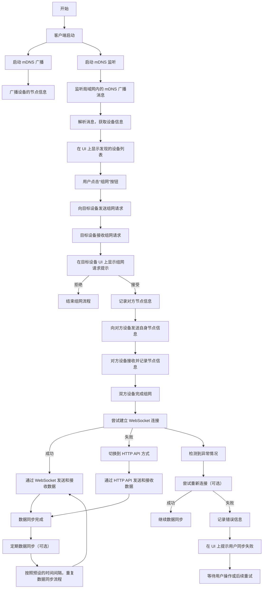

```mermaid

graph TD
    A[开始] --> B[客户端启动]
    B --> C[启动 mDNS 广播]
    C --> D[广播设备的节点信息]
    B --> E[启动 mDNS 监听]
    E --> F[监听局域网内的 mDNS 广播消息]
    F --> G[解析消息，获取设备信息]
    G --> H[在 UI 上显示发现的设备列表]
    H --> I[用户点击“组网”按钮]
    I --> J[向目标设备发送组网请求]
    J --> K[目标设备接收组网请求]
    K --> L[在目标设备 UI 上显示组网请求提示]
    L -->|拒绝| M[结束组网流程]
    L -->|接受| N[记录对方节点信息]
    N --> O[向对方设备发送自身节点信息]
    O --> P[对方设备接收并记录节点信息]
    P --> Q[双方设备完成组网]
    Q --> R[尝试建立 WebSocket 连接]
    R -->|成功| S[通过 WebSocket 发送和接收数据]
    S --> T[数据同步完成]
    R -->|失败| U[切换到 HTTP API 方式]
    U --> V[通过 HTTP API 发送和接收数据]
    V --> T
    T --> W[定期数据同步（可选）]
    W --> X[按照预设的时间间隔，重复数据同步流程]
    X --> S
    R --> Y[检测到异常情况]
    Y --> Z[尝试重新连接（可选）]
    Z -->|成功| AA[继续数据同步]
    Z -->|失败| AB[记录错误信息]
    AB --> AC[在 UI 上提示用户同步失败]
    AC --> AD[等待用户操作或后续重试]
```